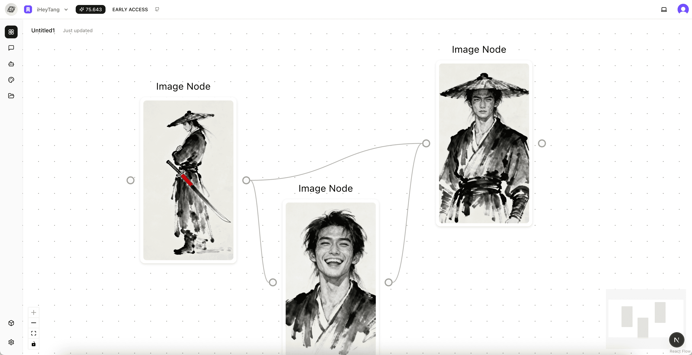

<div style="max-width:1000px">
  <h5>FlowCanvas</h5>
  
  <h5>Paintboard</h5>
  
  <h5>Chat bot</h5>
  
  <h5>Settings</h5>
  
</div>

## 项目愿景

1. 通用领域全能 AI 助手，为 AI 时代的超级个体和一人公司提供最有力的支持
2. 专精领域 AI 智能体的快速开发验证，为垂类 AI Agent 提供最好的效率平台

## 环境准备

1. 安装 `node` 环境
   - 方式 1: [推荐] 使用 nvm 包管理器 https://github.com/nvm-sh/nvm
   - 方式 2: 前往官方下载 https://nodejs.org/en
   - 方式 3: (Windows 系统) 使用 nvm 包管理器 https://github.com/coreybutler/nvm-windows/releases/tag/1.2.2

```bash
# 按照流程安装完毕后，通过命令确认安装成功
$ node -v
# 输出版本号表示安装成功
# v20.19.0
```

2. 安装 `bun` 包管理器

```bash
# Linux & MacOS
$ curl -fsSL https://bun.sh/install | bash

# Windows
$ powershell -c "irm bun.sh/install.ps1 | iex"
```

## 启动项目

1. 克隆仓库：

```bash
$ git clone https://github.com/iHeyTang/HeyFun.git
$ cd HeyFun
```

2. 安装项目依赖

```bash
# 安装项目依赖
$ bun install
```

3. 环境变量配置

```bash
# 拷贝 apps/app/.env.example 并按照注释提示修改环境变量
$ cp apps/app/.env.example apps/app/.env
```

4. 初始化数据库

项目使用 PostgreSQL 作为持久化数据库。可使用 [Docker 容器](https://hub.docker.com/_/postgres) 来启动数据库服务

```bash
# 启动 docker 容器 并自动创建 名为 heyfun 的数据库
$ docker run --name heyfun-db -e POSTGRES_USER=postgres -e POSTGRES_PASSWORD=postgres -e POSTGRES_DB=heyfun -d -p 5432:5432 postgres
# 若第一次启动项目，需要先初始化数据库，此命令会自动将表结构同步进相应配置的数据库中
$ npx prisma db push
```

5. 项目启动

```bash
# 开启项目
$ bun dev

# 开启 upstash local mode
npx @upstash/qstash-cli@latest dev
```

启动完毕后，打开 `http://localhost:7100` 即可查看

## Star History

[](https://www.star-history.com/#iHeyTang/HeyFun&Date)

## 说明

原项目为 Fork [OpenManus](https://github.com/FoundationAgents/OpenManus)，目前已归档至分支 `openmanus` 下。
当前默认分支 `main` 为使用 `Typescript` 的重构版本。

> 为什么要用 Typescript 重构？
> 本项目致力于构建一个全栈可定制的 AGI 应用。在 `app layer` 和 `agent layer` 会有大量通用的实现。使用 `Typescript` 可以完成从前端到应用服务到智能体服务的全栈无缝开发。

## 致谢

本项目灵感源自 [OpenManus](https://github.com/FoundationAgents/OpenManus) First Hackathon。在 OpenManus 的极客社区中，我不仅获得了前沿的技术交流机会，更在开源协作与创新氛围中收获了宝贵的成长。正是 OpenManus 提供的开放平台和技术支持，让 HeyFun 得以从想法落地为现实。在此，衷心感谢 OpenManus 及其社区对我的启发与帮助，愿我们共同推动 AI 技术的极客探索与无限可能！
